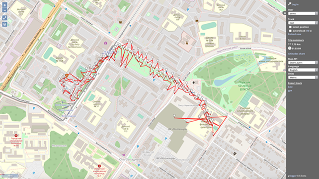

<!--
N.B.: This README was automatically generated by https://github.com/YunoHost/apps/tree/master/tools/README-generator
It shall NOT be edited by hand.
-->

# ulogger for YunoHost

[](https://dash.yunohost.org/appci/app/ulogger)    
[](https://install-app.yunohost.org/?app=ulogger)

*[Lire ce readme en français.](./README_fr.md)*

> *This package allows you to install ulogger quickly and simply on a YunoHost server.
If you don't have YunoHost, please consult [the guide](https://yunohost.org/#/install) to learn how to install it.*

## Overview

**μlogger** is a web application for real-time collection of geolocation data, tracks viewing and management. 

Together with a dedicated [μlogger mobile client](https://github.com/bfabiszewski/ulogger-android
) it may be used as a complete self hosted server–client solution for logging and monitoring users' geolocation.


**Shipped version:** 1.1~ynh1

## Screenshots



## Disclaimers / important information

## Configuration

### Login
**Name:** The user selected during installation

**Password:** Will be emailed to you immediately after installation

### How to configure this app: 
From an admin panel, or a plain file with SSH.

## Documentation and resources

* Official app website: <https://github.com/bfabiszewski/ulogger-server>
* Upstream app code repository: <https://github.com/bfabiszewski/ulogger-server>
* YunoHost documentation for this app: <https://yunohost.org/app_ulogger>
* Report a bug: <https://github.com/YunoHost-Apps/ulogger_ynh/issues>

## Developer info

Please send your pull request to the [testing branch](https://github.com/YunoHost-Apps/ulogger_ynh/tree/testing).

To try the testing branch, please proceed like that.

``` bash
sudo yunohost app install https://github.com/YunoHost-Apps/ulogger_ynh/tree/testing --debug
or
sudo yunohost app upgrade ulogger -u https://github.com/YunoHost-Apps/ulogger_ynh/tree/testing --debug
```

**More info regarding app packaging:** <https://yunohost.org/packaging_apps>
