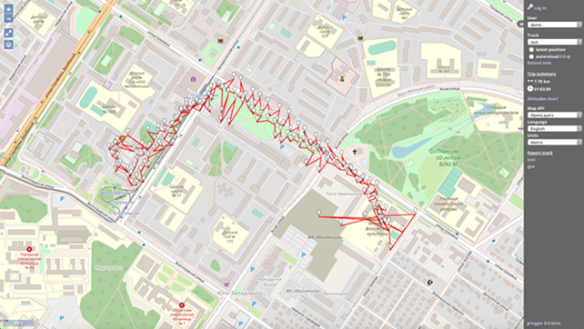

<!--
N.B.: Questo README è stato automaticamente generato da <https://github.com/YunoHost/apps/tree/master/tools/readme_generator>
NON DEVE essere modificato manualmente.
-->

# ulogger per YunoHost

[](https://dash.yunohost.org/appci/app/ulogger)  

[](https://install-app.yunohost.org/?app=ulogger)

*[Leggi questo README in altre lingue.](./ALL_README.md)*

> *Questo pacchetto ti permette di installare ulogger su un server YunoHost in modo semplice e veloce.*  
> *Se non hai YunoHost, consulta [la guida](https://yunohost.org/install) per imparare a installarlo.*

## Panoramica

μlogger is a web application for real-time collection of geolocation data, tracks viewing and management. 

Together with a dedicated [μlogger mobile client](https://github.com/bfabiszewski/ulogger-android) it may be used as a complete self hosted server–client solution for logging and monitoring users' geolocation.


**Versione pubblicata:** 1.1~ynh2

## Screenshot



## Documentazione e risorse

- Repository upstream del codice dell’app: <https://github.com/bfabiszewski/ulogger-server>
- Store di YunoHost: <https://apps.yunohost.org/app/ulogger>
- Segnala un problema: <https://github.com/YunoHost-Apps/ulogger_ynh/issues>

## Informazioni per sviluppatori

Si prega di inviare la tua pull request alla [branch di `testing`](https://github.com/YunoHost-Apps/ulogger_ynh/tree/testing).

Per provare la branch di `testing`, si prega di procedere in questo modo:

```bash
sudo yunohost app install https://github.com/YunoHost-Apps/ulogger_ynh/tree/testing --debug
o
sudo yunohost app upgrade ulogger -u https://github.com/YunoHost-Apps/ulogger_ynh/tree/testing --debug
```

**Maggiori informazioni riguardo il pacchetto di quest’app:** <https://yunohost.org/packaging_apps>
